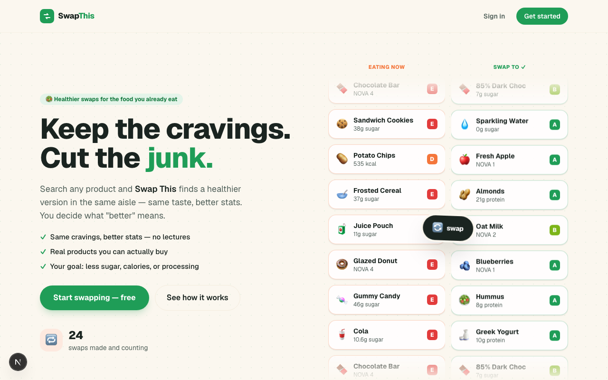

# Swap This

**Keep the cravings. Cut the junk.** Search any food, pick what you care about — calories, sugar, processing, salt, protein, or eco-impact — and Swap This finds a healthier version in the same category, sold where you live. Same taste, better stats.

Built on the [Open Food Facts](https://world.openfoodfacts.org) database of 3M+ real products.

## Screenshot



## Features

- **Search or scan** any product (live autocomplete, or barcode scanning with your camera)
- **Live mission toggle** — re-rank swaps instantly for fewer calories, less sugar, less processed (NOVA), less salt, more protein, or lower eco-impact
- **Real, buyable picks** — a country filter keeps suggestions to products sold where you are (no foreign-shelf results)
- **Product detail pages** — full nutrition, Nutri-Score, NOVA processing level, additives, allergens, ingredients, and the countries it's sold in
- **Side-by-side comparison** when you tap a swap — the winning value on each metric is highlighted
- **Impact dashboard** — stat tiles plus swaps-over-time and by-goal charts; every accepted swap adds up
- **Members & social** — public profiles, a community leaderboard, popular swaps, and shareable before/after cards
- **Members-only** app behind a lightweight, no-Google bot check; only a live global swap counter is public

## Install

```bash
git clone https://github.com/Still-InFrame/day-14-foodieapp.git
cd day-14-foodieapp
npm install
```

Copy `.env.local.example` to `.env.local` and fill in your Supabase project URL + publishable key, then:

```bash
npm run dev
```

You'll also need a Supabase project with the `foodieapp_*` tables (profiles + swaps) and their RLS policies.

## Stack

Next.js 16 (App Router) · TypeScript · Tailwind CSS v4 · GSAP · Supabase (auth + Postgres + RLS) · live Open Food Facts API.

---

Day 14 of Savion's [100 Day AI Build Challenge](https://www.100dayaichallenge.com/share/savion) — one new app, every day.
